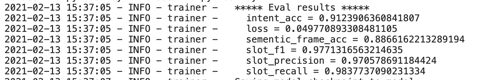

# nlu
      
```bash
$ python main.py --data_dir=./data/joint  \
                  --model_dir=model \
                  --max_seq_len=60 \
                  --do_train 
                  --do_eval \
                  --logging_steps=500 \
                  --save_steps=500
```


